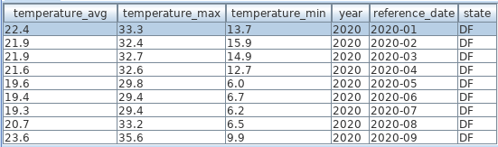
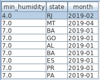

# Brazil Data Java API

API para acesso a dados abertos disponíveis no Brasil.

## Meteorologia

API para acesso a dados históricos da meteorologia no Brasil. Os arquivos e a documentação estão disponíveis em <https://portal.inmet.gov.br/dadoshistoricos>. A classe `WeatherDataImportUtil.java` é responsável por importar os registros para um banco MySQL.

Há dados meteorológicos a partir do ano 2000. Inicialmente, eram poucas estações, hoje o país está coberto com milhaes delas. Tem até estação na Antártida.

Os dados são armazenados em 2 tabelas, sendo que algumas colunas estão duplicadas para que as consultas sejam mais eficientes.

* Measurement: cada medida com os dados meteorológicos;
* Station: estação meteorológica.

Para carregar os dados no MySQL pode-se usar o *profile=load* do Spring:

```bash
mvn spring-boot:run -Dspring-boot.run.profiles=load
```

Algumas ideias de dados para consulta:

* Temperatura;
* Umidade;
* Pressão atmosférica;
* Radiação;
* Precipitação;
* Velocidade do vento.

Alguns agrupamentos disponíveis:

* Estado;
* Estação meteorológica;
* Posição (latitude e longitude);
* Altitude.

A imagem abaixo mostra a temperatura média, máxima e mínima no DF nos meses de 2020:



Em outro exemplo podemos ver a menor humidade relativa do ar coletada por estado em 2019.



## Script das tabelas

```sql
CREATE TABLE station
(
   id bigint PRIMARY KEY NOT NULL,
   altitude real,
   foundation_date date,
   name varchar(255),
   position longblob,
   region varchar(2),
   state varchar(2),
   wmo_code varchar(255)
)
;
CREATE INDEX idx_state ON station(state)
;
CREATE UNIQUE INDEX PRIMARY ON station(id)
;
CREATE INDEX idx_region ON station(region)
;
CREATE UNIQUE INDEX idx_wmo_code ON station(wmo_code)
;
```

```sql
CREATE TABLE measurement
(
   id bigint PRIMARY KEY NOT NULL,
   air_dry_bulb_temperature real,
   atmospheric_pressure real,
   atmospheric_pressure_max_prev_hour real,
   atmospheric_pressure_min_prev_hour real,
   collected_on timestamp,
   dew_point_temperature real,
   dew_point_temperature_max_prev_hour real,
   dew_point_temperature_min_prev_hour real,
   global_radiation real,
   max_temperature_prev_hour real,
   min_temperature_prev_hour real,
   month tinyint,
   relative_air_humidity real,
   relative_air_humidity_max_prev_hour real,
   relative_air_humidity_min_prev_hour real,
   state varchar(2),
   total_precipitation real,
   wind_max_gust real,
   wind_time_direction real,
   wind_time_speed real,
   year smallint,
   station_id bigint
)
;
ALTER TABLE measurement
ADD CONSTRAINT FKjnjrf7o7u7da0nefthimj167y
FOREIGN KEY (station_id)
REFERENCES station(id)
;
CREATE UNIQUE INDEX idx_station_id_collected_on ON measurement
(
  station_id,
  collected_on
)
;
CREATE INDEX idx_month ON measurement(month)
;
CREATE INDEX idx_year_month_state ON measurement
(
  year,
  month,
  state
)
;
CREATE INDEX idx_air_dry_ulb_temp ON measurement(air_dry_bulb_temperature)
;
CREATE INDEX idx_relativeairhumidity ON measurement(relative_air_humidity)
;
CREATE INDEX idx_collected_on ON measurement(collected_on)
;
CREATE INDEX idx_year ON measurement(year)
;
CREATE INDEX idx_state ON measurement(state)
;
CREATE UNIQUE INDEX PRIMARY ON measurement(id)
;
CREATE INDEX idx_year_month ON measurement
(
  year,
  month
)
;
```
